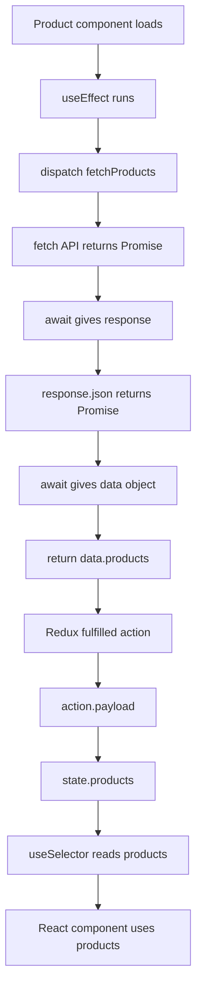

# API Call Flow



## Simple Return Flow

```text
fetch(url)
  -> Promise<Response>

await fetch(url)
  -> response object

response.json()
  -> Promise<data object>

await response.json()
  -> data object

return data.products
  -> products array

Redux fulfilled action
  -> action.payload = products array

state.products = action.payload
  -> Redux stores products

useSelector((state) => state.products.products)
  -> component receives products array
```
